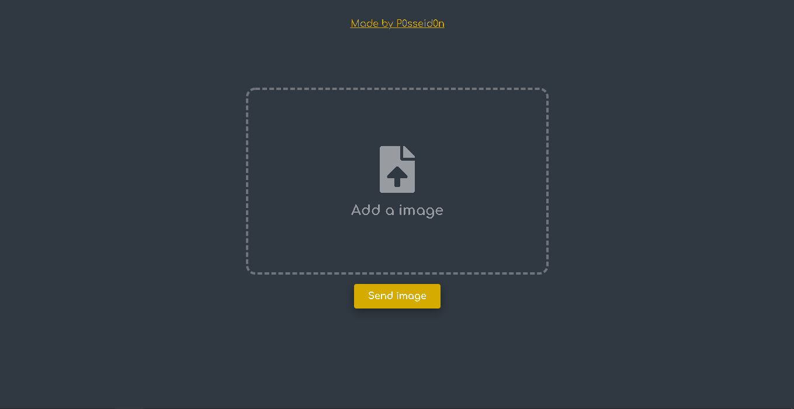

<h2 align="center">Simple image hosting</h2>

___

  

___

<h3 align="center">
  <a href="#information_source-about">About</a>&nbsp;|&nbsp;
  <a href="#rocket-technologies">Technologies</a>&nbsp;|&nbsp;
  <a href="#licence">Licence</a>
</h3>

___

## :information_source: About

Simple app to host images

 

## :rocket: Technologies

Technologies used in this project

- EJS
- Express
- SCSS
- Multer

## Licence 

MIT Licence. See the file [LICENSE](LICENSE) for more details.